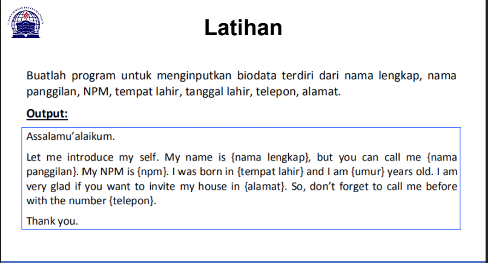
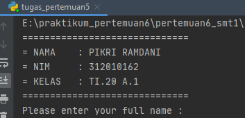

# pertemuan6_smt1
Repository ini di buat untuk memenuhi tugas bahasa pemrograman pertemuan ke 6 <br> <br>
Nama  : Pikri Ramdani<br>
Nim   : 312010162<br>
Kelas : TI.20 A.1<br><br>

## pertemuan - Tugas

Pada pertemuan 5 Bahasa Pemrograman saya diberi tugas oleh Dosen untuk membuat Aplikasi Biodata Python (seperti Gambar dibawah ini)
<br>
Saat ini saya akan menjelaskan hasil dari tugas tersebut.<br>
Berikut *source code* nya atau Klik Link berikut ( [Tugas 5 python](tugas_pertemuan5.py)): <br>
```python
print("==============================")
print("= NAMA    : PIKRI RAMDANI     ")
print("= NIM     : 312010162         ")
print("= KELAS   : TI.20 A.1         ")
print("==============================")

print("Please enter your full name : ")
fullname=input()
print("Please enter nickname : ")
nickname=input()
print("Please enter your NPM : ")
npm=int(input())
print("Please enter place of birth : ")
pob=input()
print("Please enter date of birth : ")
date=int(input())
print("Please enter your month of birth : ")
month=input()
print("Please enter year of birth : ")
year=int(input())
print("Please enter your phone number : ")
phone=int(input())
print("Please enter your address : ")
address=input()

dob=2020-year

print("\n\n Assalamu'alaikum. ")
print(f"Let me introduce my self, my name is {fullname}, but you can call me {nickname}, my NPM {npm}, I was born in {pob} and iam {dob} years old, I am very glad if you want to invite my house in {address}, So don't forget to call me before with the number {phone}, \n\n Thanks you ")
```
Berikut Penjelasannya :<br>
```python
print("please enter your full name : ")
```
Source code diatas berfungsi untuk mencetak hasil / output berupa **Please enter your full name :** (Seperti gambar dibawah ini)<br> 
